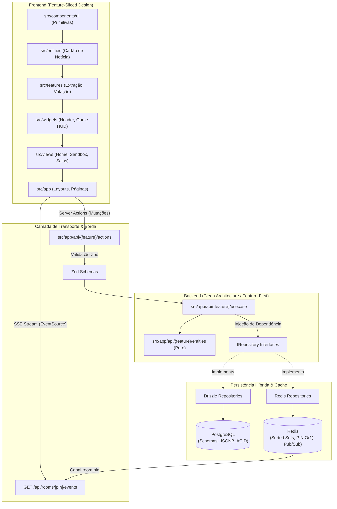

# Olimpo — Fake News AI 🏛️

> **Plataforma Gamificada de Combate à Desinformação e Fact-Checking em Tempo Real**  
> *Parceria Institucional: Pontifícia Universidade Católica de Campinas (PUCC) & Instituto de Pesquisas Eldorado*

[](https://nextjs.org/)
[](https://react.dev/)
[](https://www.typescriptlang.org/)
[](https://tailwindcss.com/)
[](https://orm.drizzle.team/)
[](https://www.postgresql.org/)
[](https://redis.io/)
[](https://vitest.dev/)
[](https://playwright.dev/)
[](openspec/)
[](docs/arquitetura.pdf)

---

## 🚨 O Problema: A "Dor" da Infodemia e Desinformação

No ecossistema digital contemporâneo, a sociedade enfrenta uma crise aguda de letramento informacional e confiança pública:

- ⚡ **Velocidade Epidêmica de Propagação**: Notícias falsas espalham-se em média **6 vezes mais rápido** do que notícias verdadeiras nas redes sociais, impulsionadas por algoritmos de recomendação que monetizam o engajamento emocional, o sensacionalismo e a indignação.
- 📉 **Ineficácia dos Métodos Tradicionais**: Palestras expositivas, cartilhas institucionais e checagens estáticas têm baixo engajamento e retenção quase nula entre jovens e estudantes. A conscientização puramente passiva não gera mudança real de comportamento.
- 🎭 **Hiper-Realismo com IA Generativa**: Boatos modernos e matérias forjadas possuem formatação visual, tipografia e vocabulário indistinguíveis de grandes portais jornalísticos, tornando a identificação visual extremamente desafiadora para o leitor comum.
- ⏳ **Decisão Impulsiva Sob Pressão**: O usuário médio decide se compartilha, valida ou reage a uma manchete em menos de **5 segundos**, sem realizar checagem cruzada ou investigar a procedência da fonte.

> 💡 **A Solução do Olimpo**: Transformar o letramento midiático em um **treinamento ativo, gamificado e competitivo sob pressão de tempo**. Ao colocar os jogadores diante de dilemas reais de fact-checking e permitir que experimentem a própria mecânica da persuasão e do blefe, o Olimpo desenvolve imunidade cognitiva, pensamento crítico e o hábito do questionamento investigativo.

---

## 📌 1. Visão Geral do Projeto

O **Olimpo** é uma plataforma educacional, interativa e colaborativa inspirada nas dinâmicas competitivas de quiz multiplayer (estilo *Kahoot*), concebida para conscientizar, engajar e treinar estudantes, cidadãos e equipes corporativas na identificação de notícias falsas (*fake news*) e no reconhecimento de jornalismo verídico.

Em salas multiplayer dinâmicas ou partidas individuais, os participantes enfrentam rodadas cronometradas com notícias e manchetes reais, decidindo sob pressão entre:
- ✖ **Fato Inconfiável / Fake News** (Desinformação / Boato)
- ✔ **Fato Real e Confiável** (Notícia Verídica / Jornalismo Investigativo)
- ❓ **Dúvida Crítica** (Necessidade de checagem mais aprofundada)

### 🎮 Mecânicas Inovadoras de Jogo
- **Desafios Autorais e Mecânica de Blefe**: Os próprios participantes podem submeter matérias da web. Caso um jogador submeta uma notícia falsa verossímil e outros participantes votem como fato verídico, o autor acumula pontos bônus de blefe por cada participante induzido ao erro.
- **Feedback Educativo com IA**: A cada rodada, o gabarito real é revelado com análise analítica explicativa (critérios de fact-checking jornalístico) e gráfico em tempo real com a distribuição dos votos da sala.
- **Placar Dinâmico e Ranking**: Pontuação calculada com precisão no Redis, bonificando rapidez de resposta, acertos consecutivos e blefes bem-sucedidos.

---

## 🏛️ 2. Fundamentos de Arquitetura e Engenharia de Software

O ecossistema Olimpo foi desenvolvido sobre uma arquitetura moderna, escalável e tipada de ponta a ponta. A documentação completa e formal de arquitetura encontra-se compilada no documento LaTeX [`docs/arquitetura.tex`](docs/arquitetura.tex) e disponível em formato PDF em [`docs/arquitetura.pdf`](docs/arquitetura.pdf).

### 📐 Resumo dos Pilares Técnicos



### 🔑 14 Decisões Arquiteturais Centrais

1. **OpenSpec (Spec-Driven Development)**: Governança técnica viva com capacidades declaradas em [`openspec/specs/`](openspec/specs/) (`auth`, `rooms`, `news-voting`, `realtime-events`, `ai-feedback`, `gamification`) e controle de mudanças em [`openspec/changes/`](openspec/changes/), assegurando alinhamento absoluto entre desenvolvedores e agentes de IA.
2. **Clean Architecture Feature-First**: Cada funcionalidade de backend em `src/app/api/{feature}/` encapsula suas próprias camadas (`entities`, `usecase`, `repositories`, `actions`, `tests`), mantendo as regras de negócio puras e agnósticas de banco e framework.
3. **Persistência Híbrida (PostgreSQL + Redis)**:
   - **PostgreSQL com Drizzle ORM**: Dados relacionais permanentes, integridade referencial e coluna `article` em formato **JSONB** para metadados flexíveis de notícias.
   - **Redis (`ioredis`)**: Armazenamento em memória de altíssimo desempenho para busca de PINs de sala em $O(1)$, placar ao vivo com Sorted Sets (`ZADD`/`ZREVRANGE`) e mensageria Pub/Sub.
4. **Next.js 16 Full-Stack**: Eliminação de duplicação de contratos através de Server Actions nativas (`"use server"`), Server Components (RSC) e isolamento rigoroso de infraestrutura com `server-only`.
5. **Server-Sent Events (SSE) para Tempo Real**: Comunicação em tempo real unidirecional nativa via HTTP/2 (`text/event-stream`) conectada ao Pub/Sub do Redis em `GET /api/rooms/[pin]/events`, evitando a complexidade operacional, limites de conexão e custos de WebSockets com estado em infraestruturas elásticas.
6. **Pronto para Serverless**: Operação stateless em lambdas efêmeras, com pool de conexões reutilizadas em `globalThis` para neutralizar vazamentos de conexões (*connection leaks*).
7. **Respostas Padronizadas de API**: Contratos de rede baseados em Uniões Discriminadas em TypeScript (`{ success: true, data } | { success: false, error }`), eliminando retornos imprevisíveis.
8. **Autenticação Segura e Gestão de Sessão**:
   - Hash irreversível de senhas com `bcryptjs` (custo de 10 rounds de salt).
   - Sessões stateless com **JSON Web Tokens (JWT)** assinados via biblioteca `jose` (validade de 7 dias).
   - Transporte blindado através de cookies gerenciados exclusivamente no servidor com flags **`httpOnly`**, **`Secure`** e **`SameSite=lax`**, prevenindo ataques XSS e CSRF.
9. **Injeção de Dependência (DI)**: Casos de uso recebem interfaces de repositório via construtor com valores padrão para produção, viabilizando testes unitários ultrarrápidos com mocks em memória sem necessidade de banco de dados ativo.
10. **Arquitetura em Camadas (Layered Architecture)**: Regra estrita de fluxo de dependência unidirecional: `Presentation (Actions)` $\to$ `Application (Use Cases)` $\to$ `Domain (Entities)` $\longleftarrow$ `Infrastructure (Drizzle / Redis)`.
11. **Validação Rigorosa de Dados**:
    - Schemas tipados de borda com **Zod v4** em todas as Server Actions.
    - Saneamento de rede anti-SSRF com **`ipaddr.js`** e DNS pinning via **`undici`** para validação de requisições de notícias.
12. **Padrão e Governança de Código**: TypeScript em modo estrito, ESLint 9, Prettier com ordenação automática de classes Tailwind, Git Hooks com Husky e lint-staged, Conventional Commits (Commitlint) e logs estruturados em JSON com **Pino**.
13. **Frontend em Feature-Sliced Design (FSD)**: Estrutura modular em camadas previsíveis: `src/components/ui/` (primitivas) $\to$ `src/entities/` $\to$ `src/features/` $\to$ `src/widgets/` $\to$ `src/views/` $\to$ `src/app/`.
14. **Pirâmide de Testes Completa**: Mais de 30 suítes cobrindo testes unitários, testes de integração de infraestrutura, testes de componentes React e testes End-to-End com Playwright.

---

## 🧪 3. Estratégia e Pirâmide de Testes

O projeto adota uma esteira completa de garantia de qualidade automatizada:

| Categoria de Teste | Escopo / Alvo | Ferramental | Comando |
| :--- | :--- | :--- | :--- |
| **Unitários de Domínio** | Entidades puras, regras de negócio e Use Cases | Vitest v4 | `pnpm test:unit` |
| **Integração de Banco e Cache** | Repositórios Drizzle, comandos Redis e streams SSE | Vitest v4 | `pnpm test:unit` |
| **Componentes de UI** | Renderização, acessibilidade e interações de tela | React Testing Library + JSDOM | `pnpm test:unit` |
| **End-to-End (E2E)** | Fluxos completos de usuário em navegadores reais | Playwright (Chromium, Firefox, WebKit) | `pnpm test:e2e` |
| **Heurísticas de Extração** | Extração de notícias da web aberta e bloqueio anti-SSRF | TSX Test Runner (`tsx --test`) | `pnpm test:legacy` |
| **Cobertura de Código** | Aferição de cobertura de linhas e branches | Vitest Coverage (V8) | `pnpm test:coverage` |

---

## 🗂️ 4. Estrutura de Diretórios do Projeto

```text
olimpo-fake-news-ai/
├── docs/                                  # Documentação formal e LaTeX
│   ├── arquitetura.tex                    # Fonte LaTeX detalhada (Calibri, Sumário, 14 Seções)
│   └── arquitetura.pdf                    # Documento compilado de arquitetura (24 páginas)
├── openspec/                              # Governança OpenSpec (Spec-Driven Development)
│   ├── specs/                             # Capacidades canônicas (auth, rooms, news-voting, sse, etc.)
│   └── changes/                           # Histórico e propostas ativas de mudanças
├── machine-learning/                      # Experimentos e pipelines de dados com scikit-learn
│   ├── supervised-learning/               # Classificação supervisionada e modelos de baseline
│   └── unsupervised-learning/             # Detecção de anomalias (K-Means, DBSCAN, Isolation Forest)
└── web-app/                               # Aplicação Full-Stack Next.js 16
    ├── drizzle/                           # Migrações SQL versionadas
    ├── tests/                             # Suítes de testes globais, componentes e E2E Playwright
    └── src/
        ├── app/                           # App Router (Páginas, Layouts e Route Handlers SSE)
        │   └── api/                       # Feature-First Backend Modules
        │       ├── auth/                  # Entidades, usecases, actions e testes de autenticação
        │       ├── rooms/                 # Gestão de salas, PIN e playlist de notícias
        │       ├── news-voting/           # Votação em 3 tiers e apuração de rodadas
        │       ├── realtime-events/       # SSE streaming e publishers Redis
        │       └── ai-feedback/           # Análise e feedback explicativo pedagógico
        ├── components/                    # Primitivas de UI agnósticas (FSD Layer: components/ui)
        ├── entities/                      # Entidades conceituais visuais do frontend
        ├── features/                      # Fatias de funcionalidades interativas (ex.: extract-news)
        ├── widgets/                       # Blocos compostos de tela (ex.: app-header, game-hud)
        ├── views/                         # Telas completas montadas (home, olimpo, sandbox)
        └── server/shared/                 # Infraestrutura singleton compartilhada
            ├── database/                  # Cliente Drizzle e Schemas PostgreSQL
            ├── redis/                     # Cliente singleton ioredis
            └── logger/                    # Logger estruturado em JSON com Pino
```

---

## 🚀 5. Como Executar Localmente

### Pré-requisitos

- **Node.js**: Versão `24.x` ou superior (compatível com `22.22+`).
- **Gerenciador de Pacotes**: `pnpm` (versão 11+ recomendada) ou `npm`.
- **Serviços de Dados**: PostgreSQL e Redis em execução local (ou via serviço gerenciado).

### Passos de Instalação

```bash
# 1. Clonar o repositório
git clone https://github.com/LucasSilvaC/olimpo-fake-news-ai.git
cd olimpo-fake-news-ai/web-app

# 2. Instalar as dependências do projeto
pnpm install

# 3. Configurar as variáveis de ambiente
cp .env.example .env.local

# 4. Executar as migrações do banco de dados relacional
pnpm db:migrate

# 5. Iniciar o servidor de desenvolvimento (escuta em 127.0.0.1:3000)
pnpm dev
```

Acesse a aplicação em seu navegador em **<http://127.0.0.1:3000>**.

### Principais Scripts e Comandos

```bash
# Executar testes unitários e de integração com Vitest
pnpm test:unit

# Executar testes em modo watch interativo
pnpm test:watch

# Gerar relatório de cobertura de código
pnpm test:coverage

# Executar testes ponta a ponta com Playwright
pnpm test:e2e

# Executar Playwright com interface visual interativa
pnpm test:e2e:ui

# Verificação estática de tipos TypeScript
pnpm typecheck

# Análise estática de código com ESLint
pnpm lint

# Formatação automática de código com Prettier
pnpm format
```

---

## 📄 6. Documentação Detalhada

Para uma imersão técnica exaustiva em cada decisão de arquitetura, consulte:
- **[Documento de Arquitetura de Software (PDF)](docs/arquitetura.pdf)**
- **[Código-Fonte LaTeX da Arquitetura](docs/arquitetura.tex)**
- **[Especificações de Domínio OpenSpec](openspec/specs/)**

---

## 🤝 7. Parcerias e Créditos

O projeto **Olimpo** é fruto da colaboração técnico-científica entre:
- **PUCC**: Pontifícia Universidade Católica de Campinas
- **Instituto de Pesquisas Eldorado**: Referência em pesquisa, desenvolvimento e inovação tecnológica no Brasil

---

<div align="center">
  <sub>Construído com rigor de engenharia pela Equipe Olimpo AI. 🏛️✨</sub>
</div>
