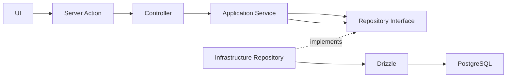

# Architecture

## Interface, pitch and room results

The public `/pitch` route renders the executive presentation in `src/views/pitch`, with its own stage sizing and styles. The main application shares `PageShell` and `Header` across home, authentication, lobby, challenge and room screens. The pitch remains independent of the game shell.

`ROUND_COMPLETED` and vote/conclusion action responses retain `officialAnswer` from the registered game answer and `modelAnalysis: null`. Their leaderboard entries include cumulative `score`, current `roundDelta` and `isCorrect`. The room consumes completion once per round across action responses and SSE, ignores stale rounds and avoids recounting a closed round restored from the server. Partial points do not count as correct answers.

`MATCH_FINISHED` carries `correctCount`, `totalAnswered` and `accuracy` calculated from persisted votes; room reloads restore correct counts from the same source. Prediction remains in `ModelAnalysisPanel`, available only after server completion, with the canonical `100 × P(Fake)` scale. The simplified verdict shows the registered answer and awarded points. General reading questions remain in the linguistic insights panel through `SocraticReflection`.

The backend follows Clean Architecture. `domain` owns entities, value objects, errors, and repository contracts. `application` orchestrates domain objects. `infrastructure` implements technical concerns such as Drizzle and PostgreSQL. `presentation` adapts validated input to application services. `composition-root.ts` creates concrete dependencies.

Frontend components use Atomic Design: atoms are reusable primitives, molecules compose atoms, organisms compose larger shared sections, and `features` own product-specific UI. Client features call Server Actions; they never import infrastructure or access the database.

Allowed imports: application → domain; infrastructure → application/domain; presentation → application/domain types. Forbidden imports include domain → Next.js/Drizzle/React, application → PostgreSQL, and frontend → infrastructure. Create an abstraction only when two real consumers need the same stable contract.

Server Action flow: form → Zod validation → controller → application service → repository interface → Drizzle implementation. Drizzle schemas live in infrastructure and migrations are generated into `drizzle/`.
