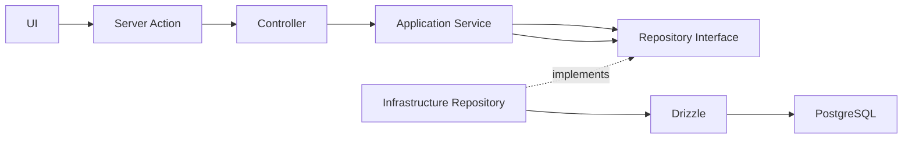

# Architecture

The backend follows Clean Architecture. `domain` owns entities, value objects, errors, and repository contracts. `application` orchestrates domain objects. `infrastructure` implements technical concerns such as Drizzle and PostgreSQL. `presentation` adapts validated input to application services. `composition-root.ts` creates concrete dependencies.

Frontend components use Atomic Design: atoms are reusable primitives, molecules compose atoms, organisms compose larger shared sections, and `features` own product-specific UI. Client features call Server Actions; they never import infrastructure or access the database.

Allowed imports: application → domain; infrastructure → application/domain; presentation → application/domain types. Forbidden imports include domain → Next.js/Drizzle/React, application → PostgreSQL, and frontend → infrastructure. Create an abstraction only when two real consumers need the same stable contract.

Server Action flow: form → Zod validation → controller → application service → repository interface → Drizzle implementation. Drizzle schemas live in infrastructure and migrations are generated into `drizzle/`.
